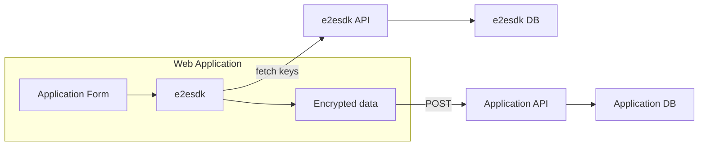
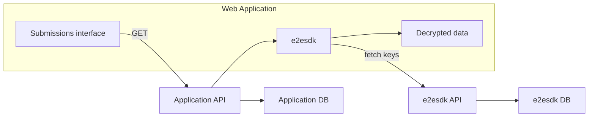

# Form submissions

e2esdk provide dedicated features for forms submissions and sharing. The full-stack example demonstrates such a scenario

## Cover these scenarios

- Random users can submit encrypted data and files to one or more recipients
- The submitted data can be re-edited by submitter
- Recipients can invite other recipients to read and interact on the data

## Architecture

While your web application is responsible of storing and distributing the encrypted data and files and provide the correct UI to users, the storing and distribution of decryption keys is entirely handled by e2esdk itself and only happens client-side.

### Random users can POST encrypted data

### Granted users can GET encrypted data and decrypt it

## Implementation

Example implementation using React, please read [React Integration](../getting-started/03-react.md) firsct.

### Create the bucket to receive form submissions

With dev tools or code

### Create the client-side form

### Encrypt and submit data

### Encrypt and submit files

### Decrypt submitted data

### Share data with peers
