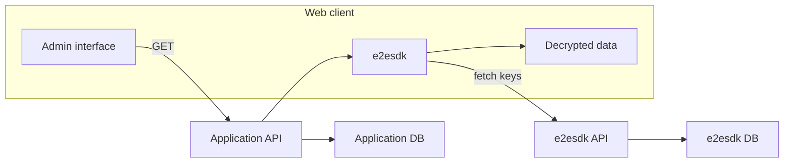

# Form submissions

e2esdk provides dedicated features for form submissions and sharing. The [full-stack example](https://github.com/SocialGouv/e2esdk/tree/beta/examples/fullstack/contact-forms) demonstrates such a scenario.

## Cover these scenarios

- Anonymous users can submit encrypted data and files
- The submitted data can be re-edited by the submitter
- Recipients can invite other recipients to read and interact on the data

## Architecture

While your web application is responsible for storing and distributing the encrypted data and files and provide the correct UI to users, the storing and distribution of decryption keys is entirely handled by e2esdk itself and only happens client-side.

### Anonymous users can POST encrypted data

### Granted users can GET encrypted data and decrypt it

## Implementation

The example implementation use React, please read [React Integration](../getting-started/03-react.md) first.

The full implementation example is available in the [contact-forms example](https://github.com/SocialGouv/e2esdk/tree/beta/examples/fullstack/contact-forms).
